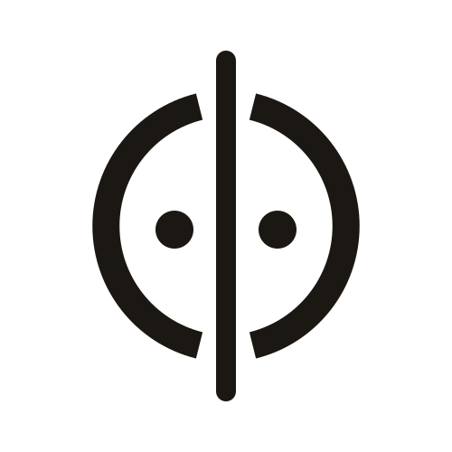
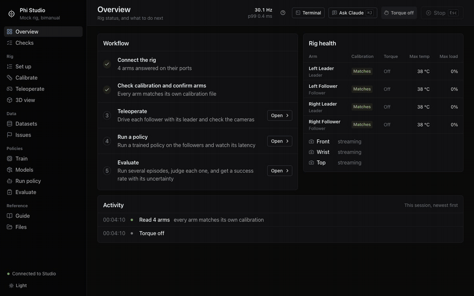

<p align="center">
  <picture>
    <source media="(prefers-color-scheme: dark)" srcset="docs/assets/phi-mark-dark.svg">
    
  </picture>
</p>

<h1 align="center">Phi Studio</h1>

<p align="center">
  <b>The robot-learning studio for SO-101 arms.</b><br>
  Set up a rig, drive it, inspect every episode, train, run and evaluate. One local app.
</p>

<p align="center">
  <a href="https://github.com/physical-hardware-intelligence/phi-studio/actions/workflows/ci.yml"></a>
  
  
  
</p>

<p align="center">
  
</p>

## Quick start

You need a Mac with the `phi` conda env (Python 3.12, LeRobot 0.6.0) and Node 20 or newer.

```bash
conda activate phi
pip install -e .
npm --prefix web ci && npm --prefix web run build
phi-studio --pairs 2
```

Studio opens in your browser on `127.0.0.1:8765`. No arms needed to look around: it starts a simulated rig, and your
recordings appear under **Datasets**.

| Option | |
|---|---|
| `--pairs 1` / `2` | one arm pair, or bimanual |
| `--port 8766` | another port |
| `--rig-dir PATH` | the phi checkout with `robot-config.yaml` (default: here, then `~/phi`) |
| `--data-dir PATH` | notes, evals and caches (default `~/.cache/phi/studio`) |
| `--no-browser` | print the link only |

## What's inside

| | Page | What it does |
|---|---|---|
| **Rig** | Set up | Port finder, camera finder and live camera alignment, with every LeRobot command pre-filled |
| | Calibrate | Each arm's homing and ranges, reviewed before saving |
| | Teleoperate | Torque, Stop, cameras and joints for each pair |
| | 3D view | The arms live in 3D, cameras placed in the scene, depth point clouds of the workspace |
| **Data** | Datasets | Every LeRobot dataset on this Mac (v3.0 or v2.1, single or bimanual), each with a health bar |
| | Episode inspector | Cameras, a 3D twin (measured arm, commanded ghost, tool path), a timeline and per-joint signals on one playhead |
| | Issues | Notes, issues and excluded episodes across datasets, shared live between windows |
| **Policies** | Train | On this Mac or on a SLURM cluster, with loss curves |
| | Models | Find a policy on Hugging Face, check it fits your rig, download it |
| | Run policy · Evaluate | Run a policy, judge each episode, get the success rate with a 95% interval |

**Inspector keys:** `Space` play · `←` `→` one frame · `Shift` + arrow one second · `[` `]` episode · `N` note ·
`B` bad · `G` good · `1` `2` `3` position, velocity, tracking

### What the analysis flags

Every threshold is measured on our own recordings and written down in `analysis.py`.

| Flag | Means |
|---|---|
| Idle start / end | The arm is still for 1.5 s or more at an end of the episode: trim it |
| Tracking | The follower is 12° or more off its leader, after removing the lag. It says why: the leader **outran** the follower, or something **held** the follower back |
| Squeeze | An object holds the gripper open while it is commanded shut: the servo keeps pushing |
| Jump | A joint moves further in one frame than an STS3215 can turn |
| Frozen | A joint never changes while its leader moves it |
| No grasp | A pick or fold task whose gripper never closes |
| Video length | A camera's video and the joint data disagree in length |
| Outlier | Length, tool path, idle time or tracking far from this dataset's median |

Mark an episode **bad** and it drops out of the `--dataset.episodes=[…]` list that Studio builds for `lerobot-train`.

## Status

| | |
|---|---|
| Simulated rig | Every page runs on it |
| Real arms | Through LeRobot's own commands, which a Run button types into Studio's terminal panel. Studio's own real-arm control is next |
| Datasets, inspector, analysis, notes | Work on real datasets today |

## Coming next

- [ ] **Real-arm control** in Studio, with the live 3D twin in Teleoperate
- [ ] **Onboarding:** name your rig, identify its arms, auto-calibrate, test drive, set the cameras, ready
- [ ] **Auto-calibration:** every joint to its mechanical stops, checked against the expected travel and compared
  across arms, so every rig calibrates the same
- [ ] **Hub datasets:** open a Hugging Face dataset without downloading it (joints in seconds, video streamed per
  episode)
- [ ] **Recording in Studio:** phase timer, a task per episode, live quality checks, keep the last 30 s
- [ ] **Eval record:** outcome, partial credit, failure tag, note and video for every rollout; checkpoints compared
  with confidence intervals
- [ ] **Remote inference** on a lab GPU, with the latency shown
- [ ] **One 3D engine** for live and replay
- [ ] **UMI and egocentric video** capture

## Develop

```bash
pip install -e ".[dev]"
ruff check src tests && mypy src && pytest -q
npm --prefix web run typecheck && npm --prefix web test && npm --prefix web run build
```

- `src/phi_studio/`: the server (aiohttp), the robot worker and rig contracts (`worker.py`, `rig.py`, `session.py`),
  setup and cameras, the Hub client, training, the 3D model (`robot_model.py`), and the data layer (`datasets.py`,
  `analysis.py`, `kinematics.py`, `notes.py`, `data_api.py`).
- `web/`: the React app. `npm run build` writes it into `src/phi_studio/static/`, which the server serves.
- `tests/`: unit and end-to-end tests on the simulated rig. Tests that need LeRobot, OpenCV or the Hub skip without
  them.
- `scripts/build_so101_model.py`: rebuilds the SO-101 model bundle from TheRobotStudio's MJCF.

## Safety and security

Studio listens on `127.0.0.1` only. Each launch makes a fresh token, and the WebSocket and the data routes check it
along with the Host and Origin. One window holds control at a time, and `Esc` stops the arms from any page.

## License

Apache 2.0, see `LICENSE`. The SO-101 model is from [TheRobotStudio/SO-ARM100](https://github.com/TheRobotStudio/SO-ARM100)
(Apache 2.0). Built on [LeRobot](https://github.com/huggingface/lerobot).
